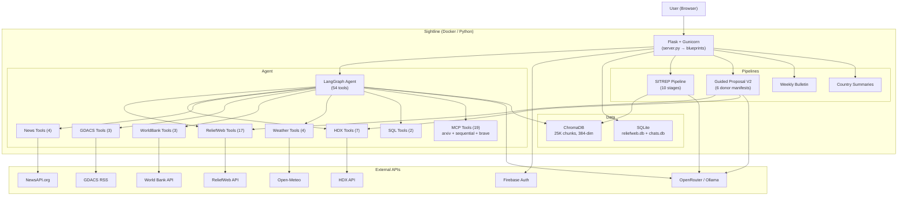

<div align="center">


# Sightline

**Humanitarian intelligence platform for crisis response teams.**

Real-time data aggregation · 10-stage SITREP pipeline · donor-compliant proposal generator.

[](LICENSE)
[](LICENSES/Commercial-LICENSE.md)
[](https://www.python.org/downloads/)
[](https://www.docker.com/)
[](tests/)
[](VERSION)

[Quick Start](#quick-start) · [Features](#features) · [Architecture](#architecture) · [Self-Hosting](#self-hosting) · [Contributing](CONTRIBUTING.md)

</div>

---

## Why Sightline?

Humanitarian professionals spend **30-60% of their time** collecting, synthesizing, and formatting
information from scattered sources — ReliefWeb, HDX, GDACS, news feeds, field reports. Sightline
automates this workflow with direct API integrations to humanitarian data sources and a
donor-compliance-aware proposal generator.

| What | How |
|---|---|
| **54-tool data agent** | Directly queries ReliefWeb (17 tools), HDX (7), GDACS, World Bank, news — reasons over results with retrieval-augmented generation. Not a generic chatbot. |
| **Donor-specific proposal generator** | 6 donor manifests (OCHA CBPF, USAID BHA, ECHO, EuropeAID PRAG, UNFPA, generic) with deterministic rule enforcement. Actual compliance validation, not generic grant writing. |
| **10-stage SITREP pipeline** | UMAP + HDBSCAN clustering → question generation → RRF retrieval → synthesis. Produces structured situation reports from raw report corpora. |

---

## Quick Start

```bash
git clone https://github.com/serkankzlrmk/sightline.git
cd sightline
cp .env.example .env
# Edit .env — fill in your API keys (see .env.example for all variables)
docker compose up -d --build
# → http://localhost:5001
```

> **No Firebase?** Set `DESKTOP_MODE=true` (with `SERVER_HOST=127.0.0.1`) to bypass auth
> for local use. Copy `static/firebase-config.example.js` to `static/firebase-config.js`
> to enable Firebase Google Sign-In.

> **No API keys?** The app starts without them — you'll see `status: degraded` on
> `/api/health`. GDACS, Open-Meteo, and World Bank work keyless. Add keys for
> ReliefWeb, HDX, News, Brave, and LLM as you get them.

See [`.env.example`](.env.example) for all configuration variables.

---

## Features

### Data Agent (54 tools)

The LangGraph agent has 35 native tools + 19 MCP tools:

| Group | Tools | API Key Required | Source |
|---|---|---|---|
| **ReliefWeb** | 17 (search sitreps, disasters, headlines, knowledge base, PDF download, source search, ingest) | `RELIEFWEB_APPNAME` | [reliefweb.int](https://reliefweb.int) |
| **HDX** | 7 (country overview, refugees, IDPs, funding, conflict events, data availability) | `HDX_APP_IDENTIFIER` | [humdata.org](https://data.humdata.org) |
| **News** | 4 (search, headlines, sources) | `NEWS_API_KEY` | [newsapi.org](https://newsapi.org) |
| **GDACS** | 3 (alerts, event detail) | ✗ keyless | [gdacs.org](https://www.gdacs.org) |
| **Weather** | 4 (forecast, geocode, air quality) | ✗ keyless | [open-meteo.com](https://open-meteo.com) |
| **World Bank** | 3 (indicators, country profile) | ✗ keyless | [worldbank.org](https://api.worldbank.org) |
| **SQL** | 2 (read-only SELECT, 5s timeout) | ✗ local DB | — |
| **arxiv (MCP)** | 10 (search, download, read, cite, semantic search) | ✗ keyless | `uvx arxiv-mcp-server` |
| **sequential-thinking (MCP)** | 1 (structured reasoning for Deep Think mode) | ✗ keyless | `npx @modelcontextprotocol/server-sequential-thinking` |
| **brave-search (MCP)** | 8 (web, news, image, video, local, summarizer, LLM context, place) | `BRAVE_API_KEY` | `npx @brave/brave-search-mcp-server` |

### SITREP Pipeline

A 10-stage automated situation report generator:

1. **Ingest** — ReliefWeb reports → ChromaDB chunks (in-memory, no disk writes)
2. **Embed** — all-MiniLM-L6-v2 (384-dim, CPU-only)
3. **Cluster** — UMAP (10D) → HDBSCAN (adaptive cluster count)
4. **Question generation** — research questions per cluster
5. **Question filtering** — dedup + relevance scoring
6. **RRF retrieval** — reciprocal rank fusion across sub-queries
7. **Answering** — RAG-grounded answers with citations
8. **Synthesis** — per-cluster summaries + global overview
9. **Report assembly** — structured SITREP with themes, countries, severity
10. **Export** — JSON + PDF (via stream events)

### Guided Proposal V2

Donor-specific proposal generator with manifest-driven compliance:

- **6 donor manifests:** OCHA CBPF, USAID BHA, EuropeAID PRAG, ECHO, UNFPA, generic
- **4-step wizard:** Situational Overview → Strategic Approach → Implementation & Coordination → Budget & Compliance
- **Tool-calling generator:** uses ReliefWeb + HDX + Brave to gather evidence
- **Blind verifier:** checks compliance against donor manifest (deterministic, no generation in validation)
- **M&E reviewer:** reviews monitoring & evaluation sections on Step 3 lock
- **Cross-section validation:** checks consistency across all 4 steps on Step 4 lock
- **PDF export:** compiled proposal with all 4 steps

### Country Intelligence Cards

- Aggregates ReliefWeb + HDX + GDACS + World Bank data per country
- 30 country summaries generated, 143 countries visible on map
- Weekly cron (Mon 07:00 UTC): only updates countries with changed `report_count`

### Freemium Preview

Anonymous visitors see: dashboard (map, global overview, crisis headlines), country summaries,
SITREP report list. Login panel appears when accessing Chat, SITREP, Bulletin, Database, Admin tabs.

---

## Architecture

```
sightline/
├── server.py                 # Flask app entry (378 lines — config, middleware, blueprint registration)
├── config.py                 # Environment-driven configuration
├── auth.py                   # Firebase token verification, RBAC decorators
├── blueprints/
│   ├── helpers.py             # Shared utilities (DB, rate limit, chat CRUD, event logging)
│   ├── main_bp.py             # Landing, SPA, /api/health
│   ├── auth_route.py          # /api/auth/me
│   ├── agent_bp.py            # Chat agent + model selection
│   ├── sitrep.py              # 10-stage SITREP pipeline
│   ├── proposal.py            # Proposal V1 CRUD + generation
│   ├── guided_proposal.py     # Proposal V2 guided wizard (4-step)
│   ├── proposal_pdf.py        # PDF export
│   ├── public_bp.py           # Map, dashboard, country data
│   ├── db_bp.py               # Database search & reports
│   ├── admin_bp.py            # Admin panel & user management
│   ├── hdx_bp.py              # HDX data endpoints
│   ├── news_bp.py             # News endpoints
│   └── ingest_bp.py           # Knowledge base ingestion
├── agent/
│   ├── relief_agent.py        # LangGraph agent definition (54 tools)
│   └── mcp_integration.py     # MCP server integration (arxiv, brave, sequential)
├── static/
│   ├── app.js                 # Core frontend (chat, SITREP, map, admin — 3700 lines)
│   ├── proposal.js            # Proposal wizard frontend (3300 lines, independently developable)
│   ├── auth.js                # Firebase auth (popup, token refresh)
│   └── firebase-config.js     # Firebase config (gitignored — see firebase-config.example.js)
├── templates/
│   └── index.html             # SPA shell
├── reliefweb_api/             # ReliefWeb + HDX API wrappers
├── tests/                     # 169 tests (pytest)
├── docker-compose.yml         # Production compose (app + Caddy)
└── .env.example               # All ~75 configuration variables
```



---

## Configuration

Sightline is configured via environment variables (`.env` file). See [`.env.example`](.env.example)
for all ~75 variables. Key ones:

| Variable | Required | Description |
|---|---|---|
| `OPENROUTER_API_KEY` | ✅ | LLM access (Gemini 2.5 Flash/Pro) |
| `RELIEFWEB_APPNAME` | ✅ | ReliefWeb API identifier |
| `HDX_APP_IDENTIFIER` | Optional | HDX API access (base64 encoded) |
| `NEWS_API_KEY` | Optional | NewsAPI.org access |
| `BRAVE_API_KEY` | Optional | Brave Search MCP (30/day limit) |
| `DESKTOP_MODE` | Optional | Bypass Firebase auth for local use (default: false) |
| `LLM_PROVIDER` | Optional | `openrouter` (default) or `ollama` (local LLM) |
| `ACTIVE_MODEL` | Optional | `google/gemini-2.5-flash` (default) |

### Models

| Key | Model | Premium | Sequential |
|---|---|---|---|
| flash | gemini-2.5-flash | No | No |
| thinking | gemini-2.5-flash-lite | No | No |
| ultra | gemini-2.5-pro | Yes | No |
| deep_think | gemini-2.5-pro | Yes | Yes (sequential_thinking tool) |

---

## Development

```bash
# Install dependencies
pip install -r requirements.txt

# Run tests
pytest tests/ -v

# Lint
ruff check .

# Start dev server (hot reload, auth bypassed)
SERVER_HOST=127.0.0.1 DESKTOP_MODE=true SERVER_DEBUG=true python server.py
```

The frontend is split into two files:
- `static/app.js` — core UI (chat, SITREP, map, admin)
- `static/proposal.js` — proposal wizard (independently developable)

Both are plain `<script>` tags — no build step required.

See [`CONTRIBUTING.md`](CONTRIBUTING.md) for the full development guide.

---

## Self-Hosting

- **Docker Compose** — app + Caddy (auto-TLS) on a VPS
- **Manual deployment** — gunicorn + systemd + nginx
- **Local desktop** — `DESKTOP_MODE=true` for offline/local use

---

## Auth & RBAC

| Role | Chat | SITREP | Bulletin | DB | Admin |
|---|---|---|---|---|---|
| free | 10/day | ✗ | read | 3 days only | ✗ |
| premium | 100/day | ✓ | read | full | ✗ |
| admin | unlimited | ✓ | generate | full | ✓ |

**Decorators:** `@require_auth`, `@require_admin`, `@require_role("premium")`, `@optional_auth`

**DESKTOP_MODE:** Set `DESKTOP_MODE=true` + `SERVER_HOST=127.0.0.1` to bypass Firebase auth
for local use. All requests get a mock admin user.

---

## License

Sightline is **dual-licensed**:

1. **AGPL v3** ([`LICENSE`](LICENSE)) — for open-source use. If you modify and distribute
   Sightline, or offer it as a network service, you must make your modifications' source code
   available under AGPL v3.

2. **Commercial License** ([`LICENSES/Commercial-LICENSE.md`](LICENSES/Commercial-LICENSE.md)) —
   for use cases where AGPL v3's copyleft obligations are incompatible with your needs
   (proprietary products, SaaS without source disclosure, enterprise internal use).

See the [Commercial License](LICENSES/Commercial-LICENSE.md) for pricing tiers.

All contributions require signing the [CLA](CLA.md).

---

## Security

See [`SECURITY.md`](SECURITY.md) for the vulnerability disclosure policy.
**Do not open public GitHub issues for security vulnerabilities.** Use
[GitHub Security Advisories](https://github.com/serkankzlrmk/sightline/security) instead.

---

## Contributing

Contributions are welcome! Please read [`CONTRIBUTING.md`](CONTRIBUTING.md) before submitting
a pull request. All contributors must sign the [CLA](CLA.md).

---

<div align="center">

Built by [Serkan Kizilirmak](https://github.com/serkankzlrmk)

**Sightline** — *Humanitarian intelligence for crisis response*

</div>